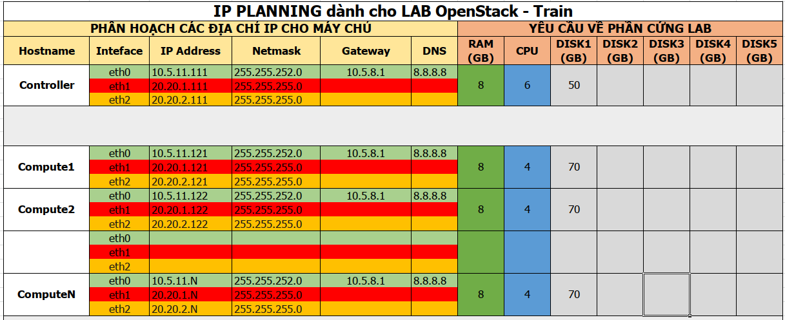

# Cài đặt OpenStack Train use OVN trên Ubuntu Server 18.04.3

# MỤC LỤC
- [1. Mô hình](#1-mô-hình)
- [2. IP Planning](#2-ip-planning)
- [3. Cài đặt thủ công](#3-cài-đặt-thủ-công)
- [4. Thực hiện chạy scripts trên từng node Controller và Compute](#4-thực-hiện-chạy-scripts-trên-từng-node-controller-và-compute)
- [5. Sau mỗi lần khởi động lại các node](#5-sau-mỗi-lần-khởi-động-lại-các-node)


# 1. Mô hình
\- Mô hình cài đặt OpenStack Train gồm 1 node Controller, nhiều node Compute.  
\- Cài đặt các project: Keystone, Glance, Nova, Neutron, Horizon.  


# 2. IP Planning
Yêu cầu phần cứng và địa chỉ IP cho các nodes.  


# 3. Cài đặt thủ công
\- Tham khảo:
- https://docs.openstack.org/train/
- https://docs.openstack.org/neutron/train/
- https://docs.openstack.org/networking-ovn/train/
- https://docs.openstack.org/networking-ovn/train/install/manual.html
- https://docs.openstack.org/networking-ovn/train/admin/refarch/refarch.html

# 4. Thực hiện chạy scripts trên từng node Controller và Compute
\- Trên tất các node:
- Thực hiện đặt mật khẩu người dùng `root` trên tất cả các node sao cho giống nhau, ở đây mình đặt là `welcome123`.  
- Download các thư mục `OPS-setup`.  

- Set quyền `755` cho các files đó.  
```
chmod -R 755 OPS-setup
```

- Thay đổi nội dung các file `OPS-setup/config.sh` theo mô hình của bạn.
- Trên node Controller, thực hiện lệnh:  
```
cd OPS-setup/CTL
source ctl-0-ipaddr.sh
init 6
```

- Trên các node Compute, sửa file `OPS-setup/COM/com_num.sh` tương ứng với số thú tự node Compute, sau đó thực hiện lệnh:   
```
cd OPS-setup/COM
source com-0-ipaddr.sh
init 6
```


\- Đứng từ một máy ở cùng dải mạng với interface `eth1` của các node, thực hiện ssh đến người dùng `root` của các node:  
- Trên node Controller, thực hiện lệnh:  
```
cd OPS-setup/CTL
source ctl-all.sh
```

> Trong khi cài đặt, hiện ra thông báo đặt mật khẩu cho `root` user của MariaDB. Ở đây bạn nhập mật khẩu là `$MYSQL_PASS` (cụ thể ở đây là Welcome123).  

- Sau khi cài đặt xong node Controller, chuyển sang các node Compute, sửa file `OPS-setup/COM/com_num.sh` tương ứng với số thú tự node Compute, sau đó thực hiện lệnh:  
```
cd OPS-setup/COM
source com-all.sh
```

- Sau môi lần cài đặt 1 node Compute, trên node Controller ta thực hiện lệnh:  
```
source OPS-setup/CTL/ctl-4-nova_discoveryhost.sh
```

\- Mỗi lần cập nhật file `OPS-setup/config.sh` để cài đặt thêm các node compute, ta cần copy lại thư mục `OPS-setup` đến các node Controller và Compute đã được cài trước đó, và thực hiện lệnh:  
```
source OPS-setup/UPDATE/update_hosts.sh
```

# 5. Sau mỗi lần khởi động lại các node
\- Thực hiện lệnh:  
```
source /root/<hostname>-ovs-config.sh
```

để cấu hình IP cho bridge `br-provider`.  

# 6. Chú ý
\- Cấu hình chỉ khác ở file neutron trên cả node Controller và node Compute.  


