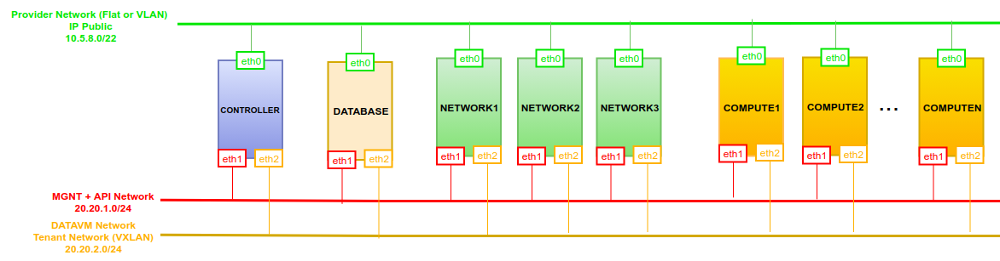
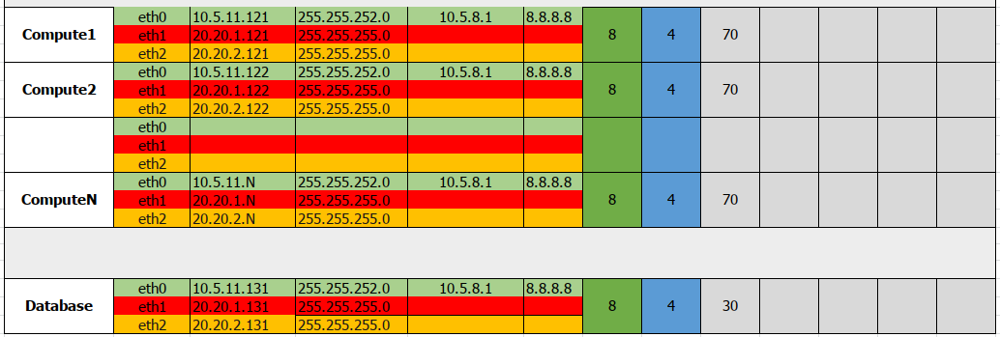

# 4. Tái tạo OVN Database từ Neutron Database

# MỤC LỤC
- [4.1. Đặt vấn đề](#41-Đặt-vấn-đề)
- [4.2. LAB](#42-lab)
  - [4.2.1. Mô hình](#421-mô-hình)
  - [4.2.2. Thực hiện](#422-thực-hiện)

# 4.1. Đặt vấn đề
\- Nếu vì 1 lý do nào đó mà OVN Northbound DB và OVN Soundbound DB mất mát, ta có thể khôi phục OVN DB đó bằng Neutron DB.  
\- OVN tạo ra thêm 3 tables trong `neutron` database:  
- ovn_hash_ring
- ovn_alembic_version
- ovn_revision_numbers

\- Table `ovn_hash_ring` chứa số dòng tương ứng với số node của mô hình. Ví dụ, 1 mô hình gồm 1 Controller, 1 Database, 2 Network, 2 Compute sẽ có dữ liệu như sau:  

```
MariaDB [neutron]> select * from ovn_hash_ring;
+--------------------------------------+------------------+---------------------+---------------------+------------------+
| node_uuid                            | hostname         | created_at          | updated_at          | group_name       |
+--------------------------------------+------------------+---------------------+---------------------+------------------+
| 7902b8e7-39f8-4b3f-815c-318c93e5f0d8 | sondx-controller | 2019-11-17 09:04:37 | 2019-11-17 02:11:38 | mechanism_driver |
| 87a7380b-48f8-4617-988b-f3ea47c2baf1 | sondx-controller | 2019-11-17 09:04:37 | 2019-11-17 02:11:38 | mechanism_driver |
| 972d711d-637b-4ab4-a9d3-11d6c5bd66bb | sondx-controller | 2019-11-17 09:04:37 | 2019-11-17 02:11:38 | mechanism_driver |
| b53f5d41-5165-4b6e-9e4c-9b0cfc19ab51 | sondx-controller | 2019-11-17 09:04:37 | 2019-11-17 02:11:38 | mechanism_driver |
| c1c6331c-e380-42c6-83ce-1aed207b1527 | sondx-controller | 2019-11-17 09:04:37 | 2019-11-17 02:11:37 | mechanism_driver |
| d11403a2-b347-44da-86c0-a7bc07109d31 | sondx-controller | 2019-11-17 09:04:37 | 2019-11-17 02:11:37 | mechanism_driver |
+--------------------------------------+------------------+---------------------+---------------------+------------------+
6 rows in set (0.000 sec)
```

# 4.2. LAB
## 4.2.1. Mô hình
  
  


\- Ở đây tôi chỉ cài 1 Controller, 1 Database, 2 Network, 2 Compute.

## 4.2.2. Thực hiện
\- Trên node Database:  
- Thực hiện lệnh:  
```
systemctl restart ovn-central
```

- Thiết lập lại lắng nghe cho OVNDB:  
```
ovn-nbctl set-connection ptcp:6641:20.20.1.131 -- \
	set connection . inactivity_probe=60000
ovn-sbctl set-connection ptcp:6642:20.20.1.131 -- \
	set connection . inactivity_probe=60000
```

Lúc này các Chassic (COM, Network) sẽ bị xóa flow trong `br-int` và `br-provider` dẫn đến mất các VM mất kết nối Internet.  

\- Trên node Controller:  
- Thực hiện lệnh sau để sinh lại OVN DB bên node Database:  
```
neutron-ovn-db-sync-util --config-file /etc/neutron/neutron.conf --config-file /etc/neutron/plugins/ml2/ml2_conf.ini --ovn-neutron_sync_mode repair
```

Các Chassic đã cấu hình flow trở lại flow trong `br-int` và `br-provider`, các VM kết nối Internet bình thường.  

- Sau khi lệnh này hoàn thành, dữ liệu trong table `ovn_hash_ring` sẽ bị xóa. Ta thực hiện lệnh sau để sinh lại:  
```
systemctl restart nova-api
```

> Chờ 1 lúc (khoảng vài giây) dữ liệu mới sinh lại đc.

- Cuối cùng:  
```
systemctl restart neutron-server
```
