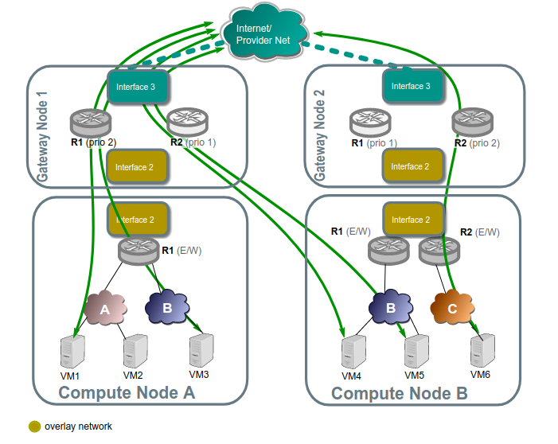

# I. Tổng quan về OpenStack sử dụng OVN

# MỤC LỤC
- [1. Giới thiệu](#1-giới-thiệu)
- [2. Tính năng của OpenStack-OVN](#2-tính-năng-của-openstack-ovn)
- [3. Workflow OpenStack-OVN](#3-workflow-openstack-ovn)
- [.4. Kiến trúc OpenStack-OVN](#4-kiến-trúc-openstack-ovn)
  - [4.1. Kiến trúc tham khảo](#41-kiến-trúc-tham-khảo)
    - [4.1.1. Layout](#411-layout)
    - [4.1.2. Hardware layout](#412-hardware-layout)
    - [4.1.3. Service layout](#413-service-layout)
    - [4.1.4. Networking khi tích hợp OVN](#414-networking-khi-tích-hợp-ovn)
    - [4.1.5. Central Floating IPs](#415-central-floating-ips)
    - [4.1.6. Distributed Floating IPs (DVR)](#416-distributed-floating-ips-dvr)
    - [4.1.7. Thêm 1 node Compute](#417-thêm-1-node-compute)
  - [4.2. Kiến trúc mở rộng](#42-kiến-trúc-mở-rộng)
- [5. Routing OpenStack-OVN](#5-routing-openstack-ovn)
  - [5.1. North/South](#51-north/south)
    - [5.1.1. Non distrubuted FIP](#511-non-distrubuted-fip)
    - [5.1.2. Distrubuted FIP](#512-distrubuted-fip)
    - [5.1.3. L3HA](#513-l3ha)
    - [5.1.4. BFD monitoring](#514-bfd-monitoring)
    - [5.1.5. Failover (detected by BFD)](#515-failover-detected-by-bfd)
    - [5.1.6. Failback](#516-failback)
  - [5.2. East/West](#52-east/west)
    - [5.2.1. Traffic going through a virtual router, different subnets](#521-traffic-going-through-a-virtual-router-different-subnets)
    - [5.2.2. Traffic across the same subnet](#522-traffic-across-the-same-subnet)

# 1. Giới thiệu
\- OVN cung cấp virtual networking cho Open vSwitch và là 1 thành phần của Open vSwitch project. Project `networking-ovn` cung cấp tích hợp giữa OpenStack Neutron và OVN.  

\- **Sự khác biệt chính giữa ML2/ovs và ML2/networking-ovn**  

|Chi tiết|ml2/ovs|ml2/networking-ovn|
|---|---|---|
|giao tiếp giữa các agent/server|rabbit mq messaging + RPC.|ovsdb protocol trên NorthBound và SouthBound databases.|
|l3ha API|routers có trường "`ha`" có thể bị vô hiệu hóa hoặc kích hoạt bởi admin với mặc định triển khai|routers không có trường "`ha`", và sẽ sử dụng HA ngay khi có nhiều hơn 1 node network|
|l3ha dataplane|qrouter namespace với keepalived proccess và 1 internal ha network cho lưu lượng VRRP|`ovn-controller` cấu hình các OpenFlow rules cụ thể, và kích hoạt BFD protocol qua tunnel endpoints để phát hiện csac vấn đề kết nối với các nodes|
|DVR API|có "`distributed`" flag trên routers, chỉ có thể cấu hình bởi admin|không có "`distributed`" flag hoặc có sẵn trên các routers thông qua API|
|DVR dataplane|sử dụng namespaces, veth, ip routing, ip rules và iptables trên các nodes compute.|Sử dụng OpenFlow rules trên nodes Compute|
|E/W traffic|đi thông qua các node Network khi router không được kích hoạt `distributed` (DVR)|distributed trong mọi trường hợp|
|Metadata Service|Metadata service được cung cấp bởi qrouter hoặc dhcp namespaces trong các nodes Network|Metadata được phân phối hoàn toàn trên các nodes Compute và được phục vụ từ `ovnmeta-xxxxx-xxxx` namespace|
|DHCP Service|DHCP được cung cấp thông qua `qdhcp-xxxxx-xxx` namespaces, có chạy `dnsmasq` bên trong|DHCP được cung cấp bởi OpenFlow và `ovn-controller`, được phân tán trên các nodes Compute|
|Trunk Ports|Trunk ports được xây dựng và tạo `br-trunk-xxx` bridges và patch ports.|Trunk ports sống trong `br-ints` cùng các OpenFlow rules, trong khí các subports được gắn trực tiếp vào `br-int`|

\- Như vậy, OpenStack-OVN mặc định hỗ **HA** (tự động sử dụng HA nếu nhiều hơn 2 nodes Gateway được tìm thấy).   
**Distributed floating IPs** sẽ được sử dụng nếu nó được cấu hình (trong file `ml2_conf.ini`, flag `enable_distributed_floating_ip`).  

# 2. Tính năng của OpenStack-OVN
\- OpenStack-OVN cung cấp các virtual network services:  
- Layer-2 (switching): Mặc định thực hiện, thay thế Open vSwitch (OVS) agent.
- Layer-3 (routing): Mặc định thực hiện, hỗ trợ distributed routing. Thay thế Neutron L3 agent.
- DHCP: Mặc định thực hiện distributed. Thay thế Neutron DHCP agent. Chú ý, việc triển khai mặc định chưa hỗ trợ tính năng DNS hoặc Metadata.
- DPDK: OVN và `networking-ovn` có thể được sử dụng với OVS mà OVS sử dụng Linux kernel datapath hoặc DPDK datapath.
- Trunk driver
- VLAN tenant networks: `network-ovn` driver hỗ trợ VLAN tenant networks khi được sử dụng với OVN version >= 2.11.
- DNS: Mặc định thực hiện. Từ phiên bản OVN 2.8 có tích hợp triển khai DNS.

\- Các tiện ích mở rộng được hỗ trợ bởi OVN, tham khảo:  
https://docs.openstack.org/networking-ovn/train/admin/features.html

# 3. Workflow OpenStack-OVN
\- Như đã biết, **OpenStack-OVS** sử dụng các agent:  `neutron-openvswitch-agent`, `neutron-l3-agent`, `neutron-dhcp-agent`, và `neutron-metadata-agent`.  
\- OpenStack-OVN** sử dụng các agent:  
`OVN Controller Gateway agent`, `OVN Controller agent`, và `networking-ovn-metadata-agent`.  


\- Workflow của mô hình **OpenStack-OVS**  


\- Workflow của mô hình **OpenStack-OVN**  


# .4. Kiến trúc OpenStack-OVN
## 4.1. Kiến trúc tham khảo
### 4.1.1. Layout
\- Kiến trúc tham khảo gồm 4 nodes: 1 node Controller, 1 node Database, 1 node Gateway, và 2 nodes Compute.  
\- Node Controller chứa các thành phần sau:  
- 1 network interface cho management
- Identity service
- Image service
- Compute management (control plane)
- Networking management với ML2 mechanism driver cho OVN (control plane)

\- Node Database chứa các thành phần sau:  
- 1 network interface cho management
- OVN northbound service (`ovn-northd`)
- Open vSwitch (OVS) database service (`ovsdb-server`) cho OVN northbound database (`ovnnb.db`)
- Open vSwitch (OVS) database service (`ovsdb-server`) for the OVN southbound database (`ovnsb.db`)

\- 2 nodes compute chứa các thành phần sau:  
- 2 hoặc 3 network interfaces cho management, overlay networks, và tùy chọn provider networks
- Compute management (hypervisor)
- Hypervisor (KVM)
- OVN controller service (`ovn-controller`)
- OVS data plane service (`ovs-vswitchd`)
- OVS database service (`ovsdb-server`) với OVS local configuration (`conf.db`) database
- OVN metadata agent (`ovn-metadata-agent`)

\- 1 node gateway chứa các thành phần sau:  
- 3 network interfaces cho management, overlay networks và provider networks.
- OVN controller service (`ovn-controller`)
- OVS data plane service (`ovs-vswitchd`)
- OVS database service (`ovsdb-server`) với OVS local configuration (`conf.db`) database

> Chú ý: Mỗi OVN metadata agent cung cấp metadata service cục bộ trên các nodes compute (theo phương pháp lightweight). Mỗi mạng được truy cập bởi instance của node compute sẽ có 1 `metadata ovn-metadata-$net_uuid` namespace, và ở trong đó có **haproxy** sẽ chuyển các yêu cầu đến `ovn-metadata-agent ` thông qua unix socket.  
> namespace rất hữu ích cho việc gỡ lỗi, ta có thể thông qua namespace truy các vào các instance trên node compute.  

### 4.1.2. Hardware layout


### 4.1.3. Service layout


### 4.1.4. Networking khi tích hợp OVN


\- Với `networking-ovn`, tất cả lưu lượng E/W đi qua virtual router phân tán, đi từ node compute này đến node compute khác mà không thông qua node gateway.  
Lưu lượng N/S cần SNAT (với không floating IPs) sẽ luôn đia qua node Gateway, mặc dù, ngay khi có nhiều hơn 1 node Gateway, `networking-ovn` sẽ sử dụng HA cho các nodes Gateway đó.  

### 4.1.5. Central Floating IPs
\- Trong trường hợp **Central Floating IPs**, lưu lượng N/S (SNAT và Floating IPs) sẽ đi thông qua node Gateway.  

### 4.1.6. Distributed Floating IPs (DVR)
\- Trong trường hợp **Distributed Floating IPs**, lưu lượng N/S SNAT sẽ đi qua node Gateway, lưu lượng N/S Floating IPs sẽ đi ra ngoài Internet ngay tại node Compute chứa instance đó.  


### 4.1.7. Thêm 1 node Compute
\- Khi ta thêm 1 node Compute vào môi trường, **OVN controller service** trên node Compute sẽ kết nối đến **OVN southbound database** và đăng kí node là 1 Chassic.  
## 4.2. Kiến trúc mở rộng
\- Kiến trúc mở rộng gồm:  
- 1 node Controller.
- Nhiều nodes Database được cấu hình HA. (>=3 nodes)
- Nhiều nodes Gateway. (>= 3 nodes)
- Nhiều node Compute

# 5. Routing OpenStack-OVN
## 5.1. North/South
### 5.1.1. Non distrubuted FIP
\- Lưu lượng North/South thông qua virtual router trên active chassic cho lưu lượng SNAT, cũng như FIPs.  


### 5.1.2. Distrubuted FIP
\- Hình dưới, chúng ta có thể nhìn thấy các VMs không gán Floating IP (VM1, VM6) sẽ giao tiếp thông qua các nodes Gateway sử dụng SNAT trên cá edge routers R1 và R2.  
Trong khi đó, VM3, VM4, và VM5 được gán Floating IP, và lưu lượng của nó trực thiếp thông local provider bridge/interface đến external network.  


### 5.1.3. L3HA
\- **Networking-ovn** thực thi L3 HA 1 cách mặc định. Bạn không cần phải kích hoạt bất cứ flags nào. Ngay khi bạn có nhiều hơn 1 chassic có khả năng hoạt động như l3 gateway đến external network được gắn đến router, nó sẽ được lập lịch router gateway port đến multiple chassic. OpenStack-OVN thực hiện điều này bằng cách sư dụng column `gateway_chassic` trong OVN table `Logical_Router_Port`.  
\- Để có kết nối đến external, 1 trong 2 trường hợp sau được áp dụng:  
- 1 số nodes Gateway có cấu hình `ovn-cms-options` với giá trị `enable-chassis-as-gw` ở column `external_ids` trong table OpenvSwitch.  
- Hoặc nếu không có Gateway nodes tồn tại (nghĩa là không có Chassic nào được thiết lập giá trị `enable-chassis-as-gw`, thì tất cả các nodes là Chassic sẽ được kích haotj là host gateway chassic).

\- Kích hoạt chassic thành host gateway:  
```
ovs-vsctl set open . external-ids:ovn-cms-options="enable-chassis-as-gw"
```

\- At the low level, functionality is all implemented mostly by OpenFlow rules with bundle active_passive outputs. The ARP responder and router enablement/disablement is handled by ovn-controller. Gratuitous ARPs for FIPs and router external addresses are periodically sent by ovn-controller itself.  

### 5.1.4. BFD monitoring
\- OVN giám sát sự tồn tại của các chassic thông qua giao thức BFD, được đóng gói trên đỉnh của Geneve tunnels, được thiết lập từ chassic đến chassic:  


\- Each chassis that is marked as a gateway chassis will monitor all the other gateway chassis in the deployment as well as compute node chassis, to let the gateways enable/disable routing of packets and ARP responses / announcements.  
\- Each compute node chassis will monitor each gateway chassis via BFD to automatically steer external traffic (snat/dnat) through the active chassis for a given router.  


\- The gateway nodes monitor each other in star topology. Compute nodes don’t monitor each other because that’s not necessary.  

### 5.1.5. Failover (detected by BFD)


\- Compute nodes BFD monitoring of the gateway nodes will detect that tunnel endpoint going to gateway node 1 is down, so. So traffic output that needs to get into the external network through the router will be directed to the lower priority chassis for R1. R2 stays the same because Gateway Node 2 was already the highest priority chassis for R2.  
\- Gateway node 2 will detect that tunnel endpoint to gateway node 1 is down, so it will become responsible for the external leg of R1, and it’s ovn-controller will populate flows for the external ARP responder, traffic forwarding (N/S) and periodic gratuitous ARPs.  
\- Gateway node 2 will also bind the external port of the router (represented as a chassis-redirect port on the South Bound database).  
\- If Gateway node 1 is still alive, failure over interface 2 will be detected because it’s not seeing any other nodes.  
\- No mechanisms are still present to detect external network failure, so as good practice to detect network failure we recommend that all interfaces are handled over a single bonded interface with VLANs.  

\- **Supported failure modes are**:  
- gateway chassis becomes disconnected from network (tunneling interface)
- ovs-vswitchd is stopped (it’s responsible for BFD signaling)
- ovn-controller is stopped, as ovn-controller will remove himself as a registered chassis.

### 5.1.6. Failback
\- L3HA behaviour is preemptive in OVN (at least for the time being) since that would balance back the routers to the original chassis, avoiding any of the gateway nodes becoming a bottleneck.  


## 5.2. East/West
\- East/West traffic on networking-ovn is completely distributed, that means that routing will happen internally on the compute nodes without the need to go through the gateway nodes.  
### 5.2.1. Traffic going through a virtual router, different subnets
\- Traffic going through a virtual router, and going from a virtual network/subnet to another will flow directly from compute to compute node encapsulated as usual, while all the routing operations like decreasing TTL or switching MAC addresses will be handled in OpenFlow at the source host of the packet.  


### 5.2.2. Traffic across the same subnet
\- Traffic across a subnet will happen as described in the following diagram, although this kind of communication doesn’t make use of routing at all (just encapsulation) it’s been included for completeness.  


Traffic goes directly from instance to instance through br-int in the case of both instances living in the same host (VM1 and VM2), or via encapsulation when living on different hosts (VM3 and VM4).  

