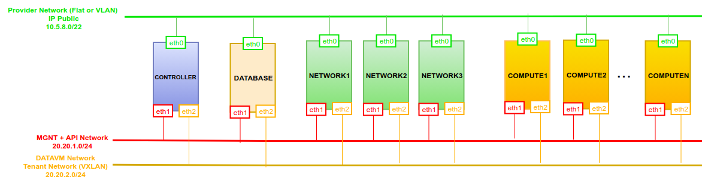

# IV. Network QoS trong OpenStack sử dụng ML2/OVN

# MỤC LỤC
- [0. Giới thiệu Network QoS trong OpenStack sử dụng ML2/OVN](#0-giới-thiệu-network-qos-trong-openstack-sử-dụng-ml2/ovn)
- [1. Cài đặt và cấu hình](#1-cài-đặt-và-cấu-hình)
  - [1.1. Mô hình](#11-mô-hình)
  - [1.2. Cài đặt và cấu hình](#12-cài-đặt-và-cấu-hình)
    - [1.2.1. Cài đặt](#121-cài-đặt)
    - [1.2.2. Cấu hình thêm QoS Bandwidth](#122-cấu-hình-thêm-qos-bandwidth)
      - [a. Node Controller](#a-node-controller)
      - [b. Các node khác](#b-các-node-khác)
    - [1.2.3. Cấu hình Trusted projects trong file policy.json](#123-cấu-hình-trusted-projects-trong-file-policyjson)
- [2. Chi tiết QoS Bandwidth limit trong OpenStack - ML2/OVN](#2-chi-tiết-qos-bandwidth-limit-trong-openstack---ml2/ovn)
  - [2.1. Tạo QoS policy và áp dụng vào neutron port của VM](#21-tạo-qos-policy-và-áp-dụng-vào-neutron-port-của-vm)
  - [2.2. Chi tiết](#22-chi-tiết)

# 0. Giới thiệu Network QoS trong OpenStack sử dụng ML2/OVN
\- Network QoS hỗ trợ 3 tính năng:  
- Bandwidth limit
- Minimum bandwidth
- DSCP marking

Ở bài này, ta chỉ tìm hiểu tính năng **Bandwidth limit**, 2 tính năng kia chưa tìm hiểu.  

\- Tham khảo:  
https://bugzilla.redhat.com/show_bug.cgi?id=1546996  

\- `networking-ovn` hiện tại chỉ hỗ trợ QoS bandwidth limitation (bandwidth limit rules) chiều `egress` trên tunnel interface của node chứa VM.  ---> Lưu lượng của VM mà không đi qua tunnel interface thì VM đó sẽ không được áp dụng QoS policy.  
  

\- VD: Với tính năng DVR trong ML2/OVN, VM sẽ không được áp dụng QoS policy.  
\- CHÚ Ý:  
Network QoS chỉ được hỗ trợ cho `port` của VM thuộc private network, không được hỗ cho `port` của VM thuộc provider network.  

# 1. Cài đặt và cấu hình
## 1.1. Mô hình
  
  

\- Mô hình OpenStack phiên bản Train được cài đặt trên Ubuntu Server 18.04. Sử dụng ML2/OVN.  

## 1.2. Cài đặt và cấu hình
### 1.2.1. Cài đặt
\- Cài đặt như mô hình 1 node Controller, 1 node Database, nhiều node Network, nhiều node Compute.  

### 1.2.2. Cấu hình thêm QoS Bandwidth
#### a. Node Controller
\- Cấu hình thêm trong file `/etc/neutron/neutron.conf`:  
```
[DEFAULT]
service_plugins = networking_ovn.l3.l3_ovn.OVNL3RouterPlugin,neutron.services.qos.qos_plugin.QoSPlugin

# enable the OVN QoS notification driver
[qos]
notification_drivers = ovn-qos
```

\- Cấu hình trong file `/etc/neutron/plugins/ml2/ml2_conf.ini`:  
```
[ml2]
extension_drivers = port_security,qos
```

\- Khởi động lại service:  
```
systemctl restart neutron-server
```

#### b. Các node khác
\- Không cần cấu hình.  

### 1.2.3. Cấu hình Trusted projects trong file policy.json
\- Các QoS policies chỉ được tạo bởi user có role `admin` đối với project với file `policy.json` mặc định.  
\- Nếu các projects được tin cậy để user quản trị các QoS policy của riêng chúng trong cloud của bạn, file `policy.json` của neutron project có thể được sửa đổi để cho phép điều này.  
\- Từ node **Controller**, thêm vào file `/etc/neutron/policy.json`:  
- Cấp quyền cho tất cả người dùng có thể cấu hình QoS policy trong project của họ:  
```
{
[...]
    "get_policy": "rule:regular_user",
    "create_policy": "rule:regular_user",
    "update_policy": "rule:regular_user",
    "delete_policy": "rule:regular_user",
    "get_rule_type": "rule:regular_user",
}
```

Trong file `/etc/neutron/policy.json` có dòng:  
```
    "regular_user": "",
```

có nghĩa là `rule` `regular_user` đại diện cho tất cả các `role` như `admin`, `user`.  


-  Enable bandwidth limit rule:  
```
{
[...]
    "get_policy_bandwidth_limit_rule": "rule:regular_user",
    "create_policy_bandwidth_limit_rule": "rule:regular_user",
    "delete_policy_bandwidth_limit_rule": "rule:regular_user",
    "update_policy_bandwidth_limit_rule": "rule:regular_user",
}
```

- Enable DSCP marking rule:  
```
{
[...]
    "get_policy_dscp_marking_rule": "rule:regular_user",
    "create_dscp_marking_rule": "rule:regular_user",
    "delete_dscp_marking_rule": "rule:regular_user",
    "update_dscp_marking_rule": "rule:regular_user",
}
```

- Enable minimum bandwidth rule:
```
{
[...]
    "get_policy_minimum_bandwidth_rule": "rule:regular_user",
    "create_policy_minimum_bandwidth_rule": "rule:regular_user",
    "delete_policy_minimum_bandwidth_rule": "rule:regular_user",
    "update_policy_minimum_bandwidth_rule": "rule:regular_user",
}
```


\- Từ node **Controller**, khởi động lại service:  
```
systemctl restart neutron-server
```

# 2. Chi tiết QoS Bandwidth limit trong OpenStack - ML2/OVN
## 2.1. Tạo QoS policy và áp dụng vào neutron port của VM
\- Tạo Qos policy và bandwidth limit rule cho policy đó:  
- Tạo QoS policy `bw-limiter` và tạo rule gán vào policy `bw-limiter`:  
```
# create qos policy
openstack network qos policy create bw-limiter

# egress rule
openstack network qos rule create --type bandwidth-limit --max-kbps 3000 \
    --max-burst-kbits 2400 --egress bw-limiter
```

- Tạo QoS policy `bw-limiter2` và tạo rule gán vào policy `bw-limiter2`:  
```
# create qos policy
openstack network qos policy create bw-limiter2

# egress rule
openstack network qos rule create --type bandwidth-limit --max-kbps 9000 \
    --max-burst-kbits 7200 --egress bw-limiter2
```

  
\- Trong mô hình này, ta có 2 mạng `provider` và `private1`.  
Mạng `provider` có dải IP `10.5.8.0/22`.  
Mạng `private1` có dải IP `10.1.0.0/24`. 

\- Có 1 router gắn vào 2 mạng với 2 port có IP: `10.5.11.244` và `10.1.0.1`.  

\- Liên kết qos policy `bw-limiter` với neutron port `port1-private1`, `bw-limiter2` với neutron port `port2-private1`:  
```
openstack port set --qos-policy bw-limiter port1-private1

openstack port set --qos-policy bw-limiter2 port2-private1
```

\- Tạo `vm1` gắn với neutron port `port1-private1` trên **node Compute2**.  
Tạo `vm2` gắn với neutron port `port2-private1` trên **node Compute2**.  

## 2.2. Chi tiết
\- Từ **node Compute2**:  
  

\- Nhận xét: Vì QoS policy được áp dụng vào tunnel interface (`eth2` interface) trên node Compute, nên:  
- Lưu lượng giữa các VM trong cùng 1 Compute không được tác động.
- Trong mô hình DVR, lưu lượng của các VM có Floating IP không được tác động.

\- Vậy Network QoS trong OpenStack sử dụng ML2/OVN chưa hoàn thiện!  
